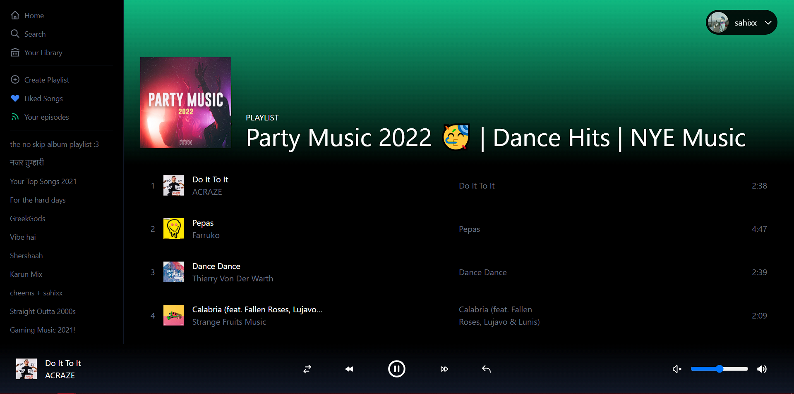
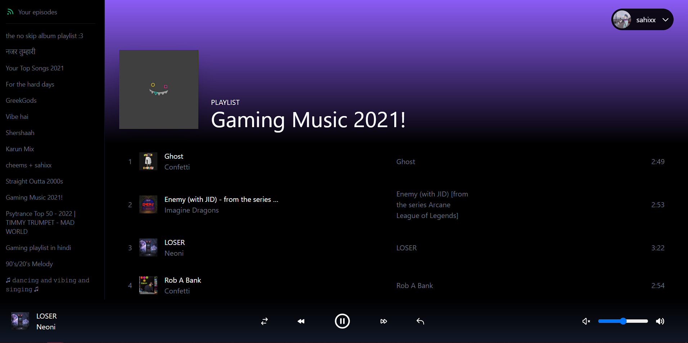

# Spotify Clone

This Repo Contains a functional Spotify Clone made using Nextjs and Reactjs

# TechStack

1. Reactjs
2. Tailwind CSS
3. Spotify Web Api
4. Recoil

# Features

1. Google Authentication with a Custom Login Page
2. An logout feature is available
3. Users can sign into their spotify profile and can choose any song from their playlists
4. Users can pause, resume and can control volume of songs
5. Fully Responsive

# Features to be added later in the future

1. Sidebar for mobile devices

# Note

1. You need Spotify premium for playing songs

# Preview

